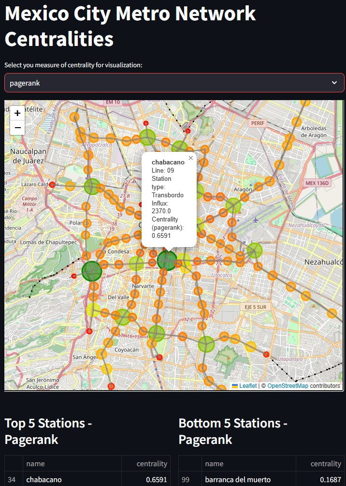

## Portfolio

---

### Projects 

[Project 1 Metro (Mexico City) Centrality Analysis](/metro_page)

<!-- -->

---
[Project 2 Title](/pdf/sample_presentation.pdf)

---
[Project 1 EcoBici (Mexico City) PageRank use case](/page3)

---

### Academic work

- [Teaching](http://example.com/)
- [Publications](http://example.com/)
- [Professional exams](http://example.com/)
- [Academic presentations](http://example.com/)

---

---

Page template forked from <a href="https://github.com/evanca/quick-portfolio">evanca</a>

<!-- Remove above link if you don't want to attibute -->
